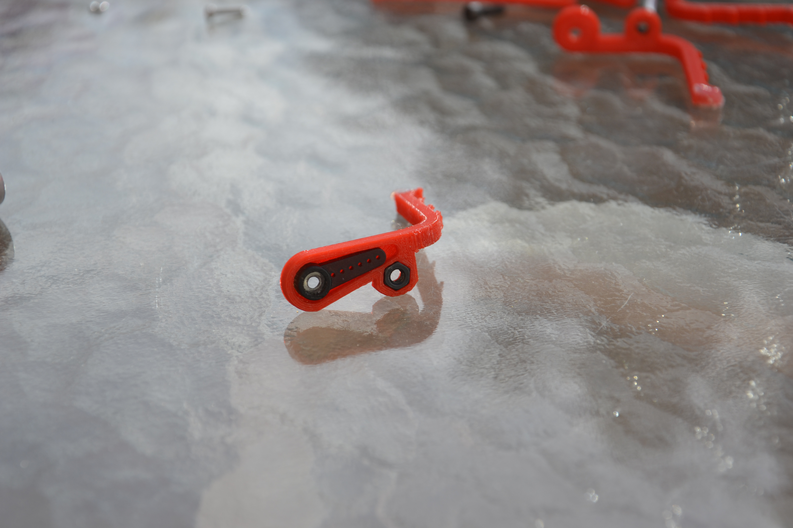
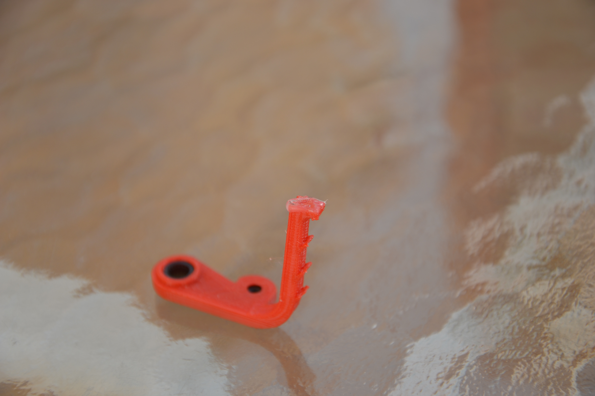
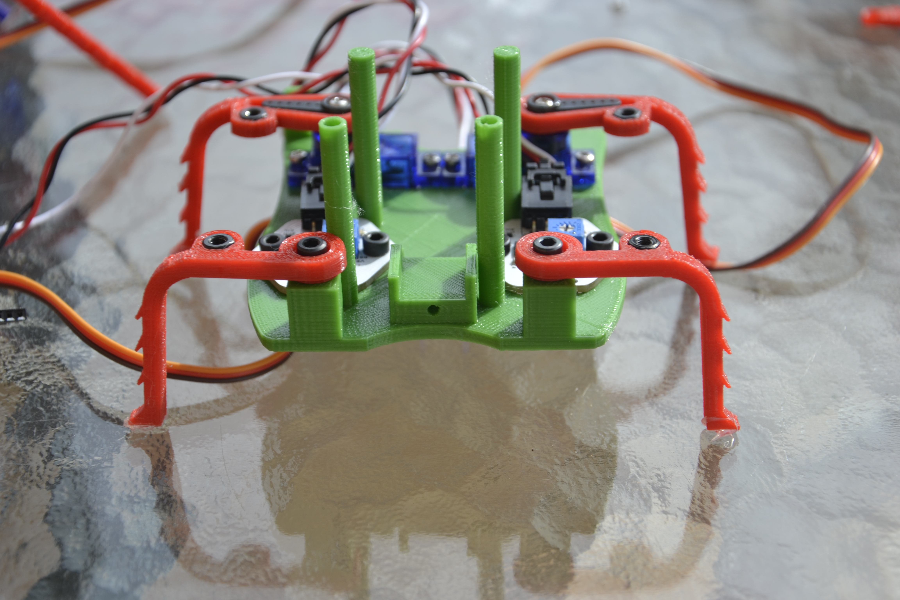
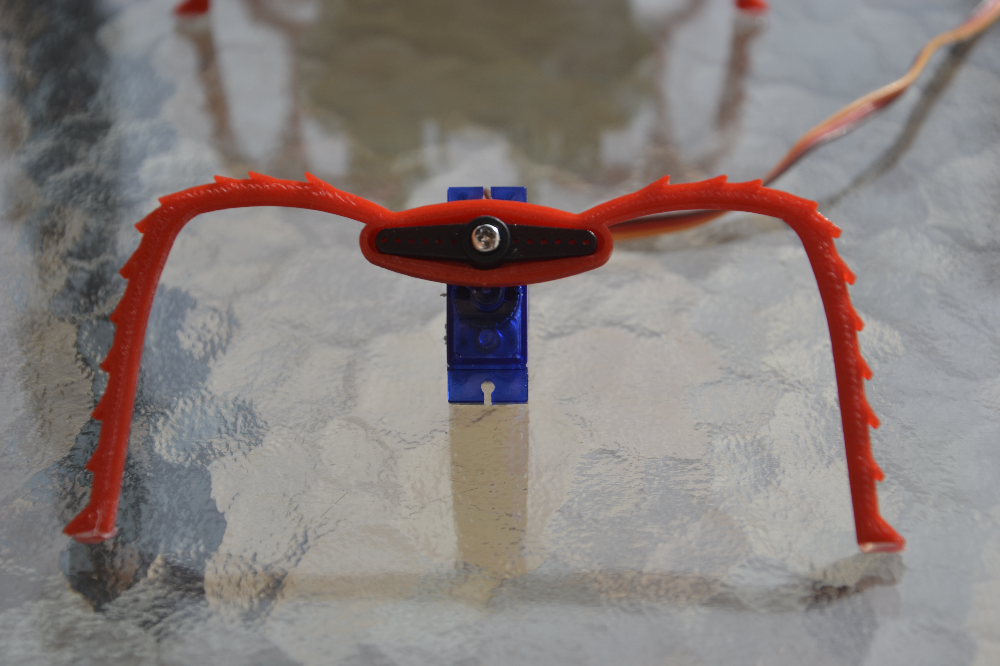

# Doodle- Instrucciones de montaje

  

**Un pequeño vídeo**

  

  

Aquí tienes una guía paso a paso para montar a Doodle. Doodle es un robot muy sencillo por lo que su montaje no debería llevarte más de media hora.

## Materiales

### Electrónica

* 1x-Icezum Alhambra, Arduino UNO o placa equivalente.

* 3x-Micro servomotores pequeños de la familia SG90R. En el robot original se han usado servomotores **SG92R** pero cualquier servomotor de un tamaño similar debería funcionar.

* [Opcional] 2x-Baterías lipo 3.7 V 240 mAh + Cargador compatible. Existen muchas baterías lipo de este tipo. Un ejemplo:

  http://www.dx.com/p/502030-240mah-rechargeable-polymer-li-ion-battery-silver-227107

* [Opcional] Sensores o servomotores adicionales. En la parte delantera del robot hay dos hendiduras donde pueden agregarse sensores de kits de robótica tipo bq zum o similares o dos servomotores.

### Tornillos y cabezales de servomotor

Necesitarás tornillos de **métrica M3 y M2** así como **los tornillos que vienen con los servomotores**. Los **tamaños** de cada tornillo **no son excesivamente importantes** por lo que podrás realizar el montaje con cualquier tornillo de las métricas M2 o M3 que tengas a mano.

* 4x-Tornillos M2x10

* 1x-Tornillo M2x15 o similar

* 8x-Tornillos M3x8

* 4x-Tornillos M3x25 [2 Opcionales-Portabaterías]

* Tornillos y cabezales incluidos con los servos.

* 1x-Cabezal doble

* 2x-Cabezal simple

### Piezas 3D

Necesitarás imprimir:

* 1x-Pata delantera izquierda

* 1x-Pata delantera derecha

* 1x-Pata trasera izquierda

* 1x-Pata trasera derecha

* 1x- Pata central

* 2x Links de patas

* 1x base

* [Opcional] 1x-Portabaterias

* [Opcional] 2x-Ojitos saltones

***
## Montaje paso a paso

**1-** Introduce los dos servomotores en su hueco de la parte trasera del robot. Atorníllalos con tornillos y tuercas M2x10

  

**2-** Con cuidado, introduce la tuerca en las patas traseras Dependiendo de tu impresora y calibración tendrás que introducir las tuercas con un poco de presión o incluso aplicando calor. Coloca también el *horn* de un solo brazo dentro de la pata, introduciéndolo a presión hasta que que su lado posterior quede dentro de la pata.

  

  **Consejo:**

  Aunque no es imprescindible,  para hacer que tu robot tenga más adhesión puedes poner un poco de silicona en sus patas utilizando una pistola de termofusible. Procura que el pegote que pegues no sea demasiado grande y quede plano sobre la pata.

  

**3-** Introduce los *horns* de un solo brazo en cada pata y coloca las patas sobre los servomotores. Aunque más tarde podrás corregirlo sin problemas, **es importante** que ahora intentes colocar las patas en los servos de forma que tengan una amplitud de movimientos de hasta 90 grados hacia atrás y chocando con la base hacia delante, siendo el ángulo cero el perpenticular a la base. Para ello puedes incluso crear un pequeño programa donde pongas tus servos a cero grados y aprovecha para atornillarlos.

     

**4-** Si vas a colocar algun sensor o servo adicional en las ranuras delanteras, es un buen momento para hacerlo. Utiliza tornillos y tuercas M3 para los sensores y tornillos y tuercas M2 para los servomotores.

  

  **Consejo:**

  En el caso de que vayas a colocar el portabaterias inferior, atornilla solo los tornillos de los sensores de la parte exterior, deja los agujeros centrales sin atornillar.     

**5-** Atornilla las patas delanteras en los agujeros de delante utilizando tornillos y tuercas M3. Recuerda que la pata debe poder girar libremente, por lo que no la aprietes demasiado . Puedes usar tornillos M3x10 o inferiores si no vas a colocar un portabaterias en la zona inferior, o utilizar tornillos M3x18 en caso afirmativo.

  

**6-** Atornilla los links o transmisores de movimiento sobre las patas. Los pelos del insecto deben quedar en la parte exterior del robot. Utiliza tornillos M3x8 y recuerda apretar bien pero permitiendo el movimiento de las patas.

  

**7-** Coloca el *horn* doble en la pata grande central. Atornilla la pata al servomotor recordando que la posición 90 grados será la posición natural de la pata, totalmente horizontal.

  

**8-** Encaja el servomotor central en la base situada en la parte delantera. Aseguralo utilizando un tornillo largo y una  tuerca M2.

  

**9-**  Coloca tu FPGA Icezum Alhambra o una placa Arduino Uno o equivalente, atornillándola con tornillos M3 en las columnas delanteras del robot.

  

  **Consejo:**

  Antes de colocar la placa procura que tus cables pasen por la zona central del robot en la parte trasera, situándose entre ambos servos.

  

**10-** Decora tu robot colocándole un par de ojitos saltones en la parte delantera.

  ¡Doodle está listo para la acción!

      

***
[Opcional-Portabaterías]

En el caso de que desees colocar el portabaterias deberás utilizar tornillos largos M3x18 o más en la zona en el paso 5 con sus respectivas tuercas en la parte inferior.

